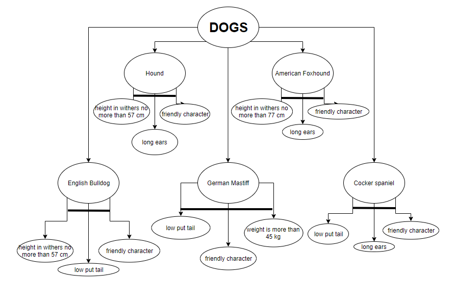
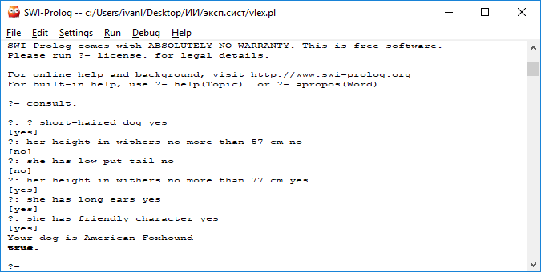
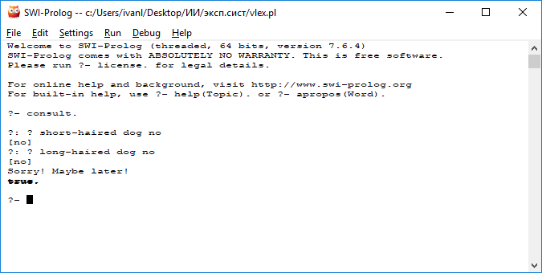

# Отчет по лабораторной работе
## по курсу "Искусственый интеллект"

### Студент: 

Лебедев И.Н.

## Результат проверки

| Преподаватель     | Дата         |  Оценка       |
|-------------------|--------------|---------------|
| Сошников Д.В.     |              |               |

> Экспертная система очень простая, не содержит промежуточных рассуждений, и может быть более эффективно реализована простой таблицей.

## Тема работы

Экспертная система - помощник в выборе собаки для дальнейшей покупки.
## Концептуализация предметной области

Были выделены следующие понятия:  
 Длинноухость.  
 Рост.  
 Вес.  
 Дружелюбность.  
 Хвост. 
 
 Так как информация о предметной области не изменяется во время работы ЭС -> предметная область статическая и представление знаний в базе знаний также будет статическим.  

## Принцип реализации системы

В экспертной системе используется механизм обратного логического вывода. Его можно очень легко реализовать на Прологе, потому что он соответствует встроенному стилю формирования рассуждений языка Пролог. По этой же причине и, помня курс Логического программирования, я выбрал для реализации ЭС язык программирования Пролог.

## Механизм вывода

Механизм вывода работает следующим образом: во время работы системы пользователю задаются вопросы и, в зависимости от ответов на них, в базу знаний с помощью предиката assert подгружаются новые факты(непосредственно во время работы программы). Далее, после добавления очередного факта, Пролог в зависимости от него либо задает следующий вопрос для данного варианта решения либо переходит к следующему варианту и система задает новые вопросы. Если какое-либо решение было найдено система отвечает на вопрос, иначе завершается с извинением и предложением попробовать позже.  

## Извлечение знаний и база знаний

Дерево И-ИЛИ  

## Протокол работы системы

  

## Выводы

Данная лабораторная работа научила меня принципам конструирования и разработки экспертных систем. Благодаря выполнению этой работы я смог узнать что же такое ЭС, в чем состоят этапы её разработки, сколькими различными способами можно представить знания о предметной области. Узнал много нового о поиске решений в языке Пролог, вспомнил о парадигме логического программирования. Познакомился с простой реализацией прямого и обратного логического вывода в Прологе, но обратный показался мне более легким для непосредственного программирования, поэтому я выбрал его.    
В ходе выполнения работы я задумался над тем, что если бы предметная область была мне не знакома или нужно было бы сделать более "серьезную" экспертную систему, то мне понадобилось бы самому получать эти новые для меня знания и общаться с экспертами в этой области, чтобы понять как они обдумывают конкретную проблему, на что обращают внимание сначала и т.д.  
Также я понял, что если пока компьютер и не может думать как человек, то помочь, а в некоторых случаях и заменить эксперта в некоторой области он вполне спопсобен, при надлежащем проектировании и реализации ЭС конечно, но мне как человеку было бы спокойнее, зная что выводы ЭС хотя бы иногда проверяются экспертом-человеком.  
На мой взгляд, основными сложностями являются: задача правильно составить базу знаний, не перегружая её избыточными правилами и фактами, спроектировать механизм вывода таким образом, чтобы при получении решения(ответа) ЭС рассматривала бы вопросы и факты в том же порядке, что и большинство экспертов. 

